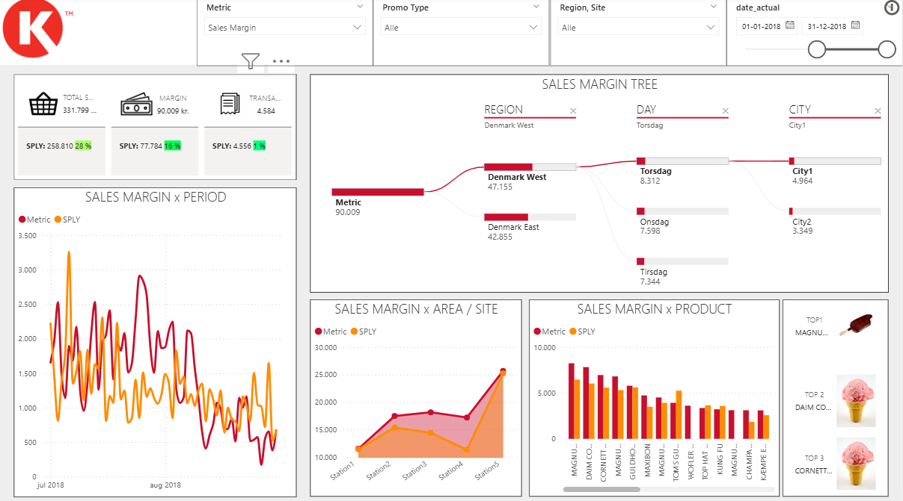
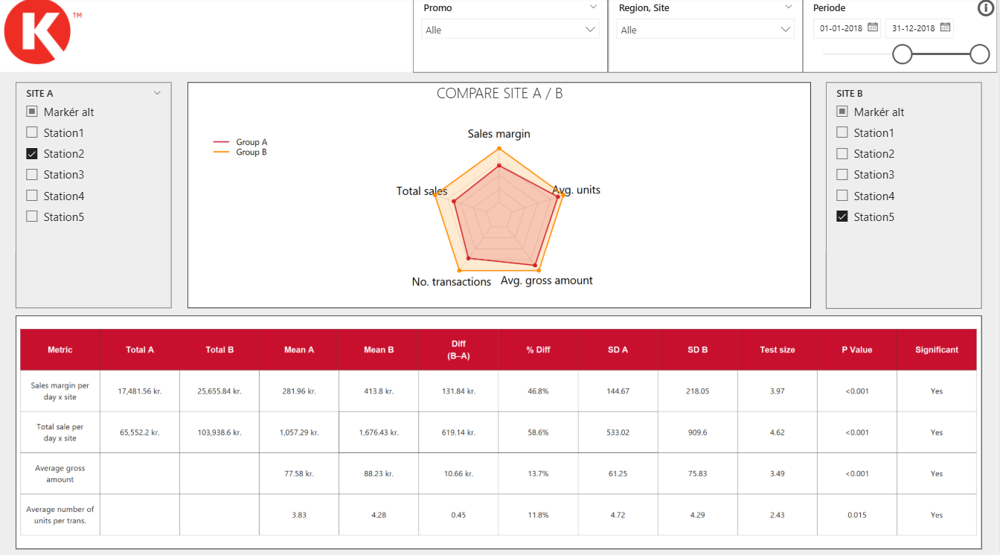
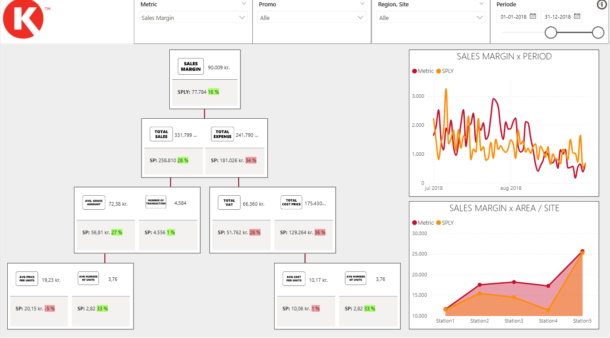
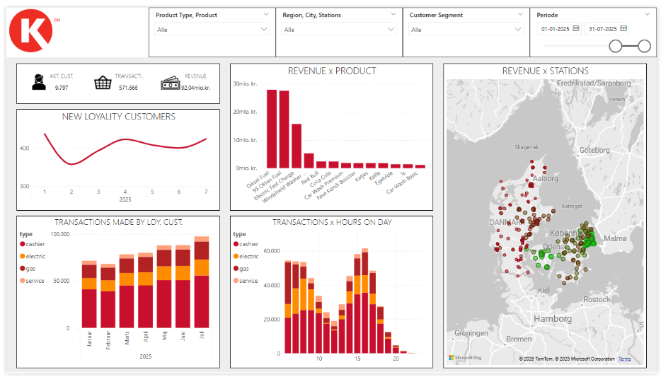
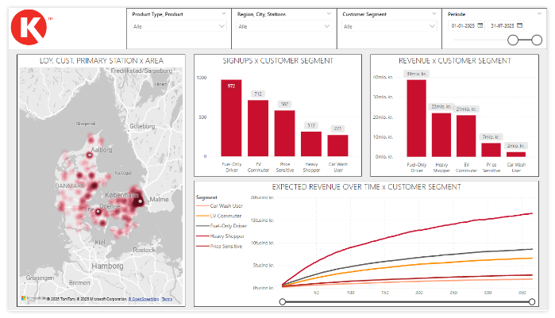
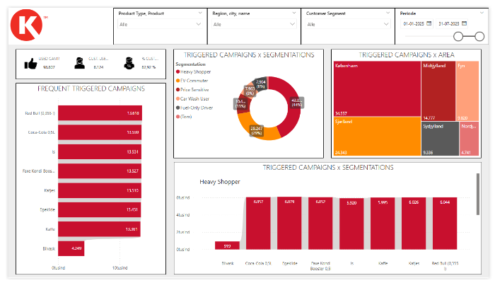
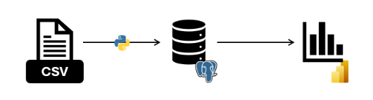
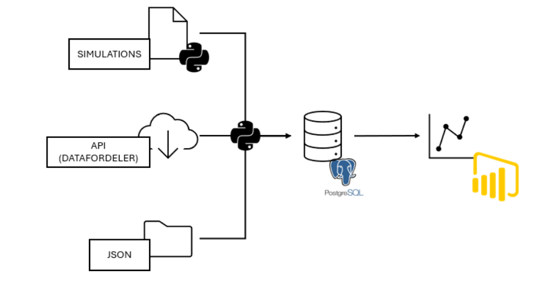
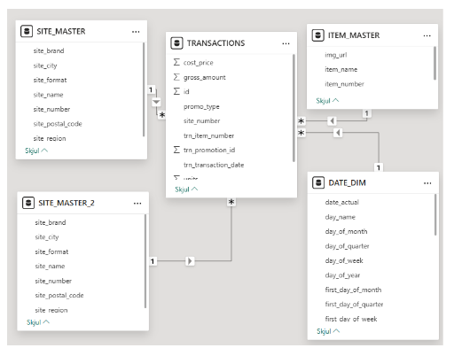
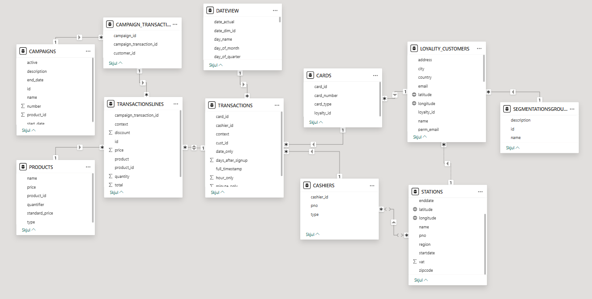

# Circle K Data & Analytics Cases

This repository contains two linked Circle K cases:

- `Interview case`
  Focused on ice-cream sales in 2017-2018, promotion impact, site comparison, and KPI decomposition in Power BI.
- `Simulation case`
  A synthetic end-to-end loyalty analytics solution covering data generation, ETL, PostgreSQL, semantic modeling, and reporting.

The project also includes a GitHub Pages-ready static site in [site/html/index.html](site/html/index.html).

## Purpose

- `Interview case`
  Build a clean data model and a short Power BI analysis of Danish ice-cream sales, including the 2018 promotion effect.
- `Simulation case`
  Demonstrate a realistic Circle K loyalty pipeline from Python simulation and external Danish geography data to Power BI dashboards.

## Results

- `Interview case`
  2018 total sales increased by about `28%` and sales margin by about `16%` versus 2017.
- `Interview case`
  The promotion mainly lifted basket size, with the strongest effect at Station `1` and `3`, especially in the period `24 July` to `4 August`.
- `Simulation case`
  The first half of 2025 simulation produced about `474,000` transactions and about `DKK 76 million` in revenue.
- `Simulation case`
  Fuel-Only Driver had the most sign-ups, Heavy Shopper showed the highest long-term value, and the energy-drink campaigns were triggered most often.

## Power BI Report Pages

<table>
  <tr>
    <td align="center" width="33%">
      <strong>Interview - Overview</strong><br/>
      <br/>
      High-level KPIs, SPLY comparison, trends, and top products.
    </td>
    <td align="center" width="33%">
      <strong>Interview - Compare Sites</strong><br/>
      <br/>
      A/B comparison between site groups with significance testing.
    </td>
    <td align="center" width="33%">
      <strong>Interview - Driver Tree</strong><br/>
      <br/>
      KPI decomposition from margin down to units, price, and expense drivers.
    </td>
  </tr>
  <tr>
    <td align="center" width="33%">
      <strong>Simulation - Overview</strong><br/>
      <br/>
      Revenue, volume, geography, and product performance for the loyalty program.
    </td>
    <td align="center" width="33%">
      <strong>Simulation - Segmentation</strong><br/>
      <br/>
      Behavioral differences and value patterns across customer segments.
    </td>
    <td align="center" width="33%">
      <strong>Simulation - Campaigns</strong><br/>
      <br/>
      Campaign engagement, triggered rewards, and regional variation.
    </td>
  </tr>
</table>

## ETL And Semantic Model

| Area | Visual | Description |
| --- | --- | --- |
| Interview ETL |  | CSV files are loaded into PostgreSQL, structured in SQL, and exposed to the interview PBIP model. |
| Simulation ETL |  | Docker services orchestrate Datafordeler ingestion, seed loading, simulation, and reporting tables. |
| Interview semantic model |  | The interview report uses a simple star schema around `TRANSACTIONS`, `DATE_DIM`, `ITEM_MASTER`, and `SITE_MASTER`. |
| Simulation semantic model |  | The simulation model extends the reporting layer with loyalty customers, cards, campaigns, stations, and transaction lines. |

## Repository Layout

- `docs`
  Source documents used for the case write-up and project context.
- `resource`
  Shared assets such as CSV input, JSON input, and Power BI images/themes.
- `site`
  Static GitHub Pages-ready site with HTML, CSS, and report visuals.
- `source/code`
  Python package, runtime definitions, and Docker services.
- `source/workspaces`
  PBIP workspaces plus Tabular Editor automation assets.

## Recommended Run Order

Create the Docker network once:

```powershell
docker network create data_network
```

Then run the services:

```powershell
docker compose -f source\code\service\database\docker-compose.yml up -d
docker compose -f source\code\service\etl\service_create_table_views_from_sql\docker-compose.yml up --build
docker compose -f source\code\service\etl\service_interview_case1\docker-compose.yml up --build
docker compose -f source\code\service\api\service_dataformidler_download_files\docker-compose.yml up --build
docker compose -f source\code\service\etl\service_json_to_client\docker-compose.yml up --build
docker compose -f source\code\service\etl\service_simulation\docker-compose.yml up --build
```

The ETL/API services are one-shot containers, so `Exited (0)` is the expected successful end state.

## Notes

- The interview write-up is based on `docs/interview`.
- The simulation purpose and summary are based on `docs/simulation`.
- Shared runtime logs use Python `logging`, so service progress is visible directly in Docker logs.
